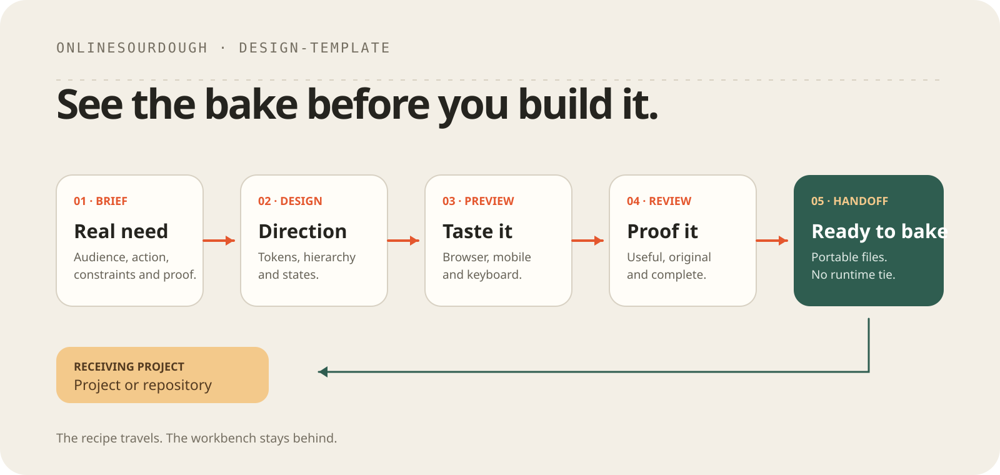

# Design-template

Turn a brief into a design you can inspect before anyone builds the product.

```text
BRIEF.md → DESIGN.md → browser preview → review → handoff
```

Use it when a visual direction, interface, landing page, workspace, or report
needs to be decided. Skip it when the solution has no meaningful visual layer.

Browse the [active showcase](examples/index.html) for the current directions.

## Start

```sh
npm install
npm run preview
```

The preview serves `examples/index.html` by default. Pass `workspace` after
`--` when you need to inspect the working preview instead.

1. Replace the prompts in `workspace/BRIEF.md` with real context.
2. Use [`design-solution`](.agents/skills/design-solution/SKILL.md) to create the design
   and preview.
3. Use [`review-design`](.agents/skills/review-design/SKILL.md) to review the result.
4. Run:

```sh
npm run check
npm run handoff -- workspace
```

The receiving project or repository copies the approved handoff and becomes
its canonical owner. Nothing here is required at runtime.

## What the handoff contains

- `DESIGN.md`
- `index.html` and local assets
- `theme.css`
- `tokens.json`
- `tailwind.theme.json`
- `HANDOFF.md`

Four active examples show the full route for a service landing page, an
operations workspace, an executive Power BI dashboard, and the
resources.onlinesourdough direction. They are examples, not prescribed styles.

## Sources

Google Design.md is the pinned format and export tool. The compact workflow and
review criteria also incorporate selected, attributed lessons from four MIT
design repositories. See [SOURCES.md](docs/SOURCES.md) and
[THIRD_PARTY.md](docs/THIRD_PARTY.md); no external skill catalog is vendored.
