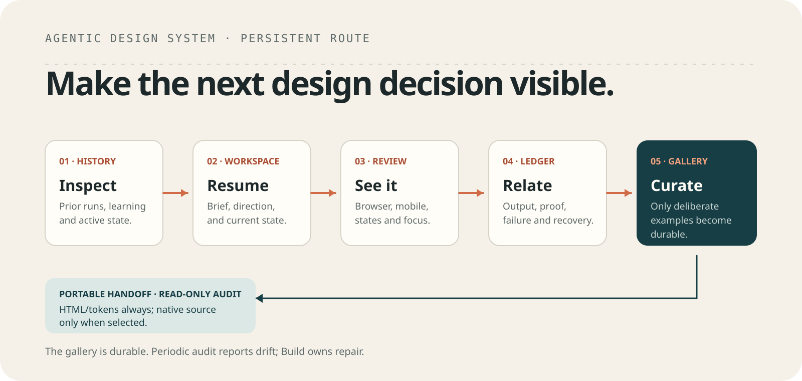

# Agentic Design System

Agentic Design System (ADS) turns resolved intent into an approved, portable
visual design direction whose required artifact is `DESIGN.md`, with optional
assets and tool-native sources bound by a reviewed cross-owner handoff. It
serves websites, applications, dashboards, reports, slides, marketing/content
surfaces, and other visual outcomes. It is a repeatable standalone work surface,
not a project template, receiving implementation, or installed runtime library.

```text
prior runs → brief → canonical DESIGN.md → selected preview → review → evidence → deliberate gallery promotion
                                      ↘ cross-owner HANDOFF.md + optional companions
accumulated truth ─────────────────────→ read-only periodic audit
```

The durable model is small:

```text
workspace/   active work, state, history, learning, and optional engine
examples/    deliberately promoted, self-contained design proof
docs/        contract, source audit, architecture, validation, references
```

## Start locally

```sh
npm install
npm run preview
```

The server opens the examples gallery at `http://localhost:4173/`. Pass a
directory after `--` to preview a specific surface, for example:

```sh
npm run preview -- workspace
npm run preview -- examples/onlinesourdough-resources
```

The [local skill index](.agents/skills/README.md) is the ownership map for
ADS-specific, repeatable methods. The primary agent entry is
[`agentic-design-system`](.agents/skills/agentic-design-system/SKILL.md). It
inspects prior runs, works in `workspace/`, and routes the internal
[`design-solution`](.agents/skills/design-solution/SKILL.md) and
[`review-design`](.agents/skills/review-design/SKILL.md) methods. Those methods
remain separate so a design can be authored and reviewed without duplicating
the System route. The ADS-local
[`audit-design-system`](.agents/skills/audit-design-system/SKILL.md) method
checks accumulated drift without repairing or creating anything. Global and
cross-project skills are installed by the calling plugin or harness and do not
become ADS-owned files.

## Adaptive references

The Codex conversation is the reference interface: callers provide links,
screenshots, prior work, or vague intent, and ADS responds `direct`, `discover`,
or `explore` inside its existing design route. Caller media stays caller-owned;
ADS retains only pointers and extracted signals. For unresolved direction the
agent may show a relevant subset of six compact internal baseline cards in the
conversation—never a separate catalogue or configuration surface. Every
accepted outcome still resolves into canonical `DESIGN.md`.

## Verify a route

```sh
npm run check
npm test
npm run trace -- --slug clean-clone-proof --source-decision --preview --review --promote-example
npm run trace:audit
npm run handoff -- workspace workspace/handoff --receiving-owner "Agentic Design System"
```

The tracer uses only the standard library. It can also prove a recoverable
failure relation:

```sh
npm run trace -- --slug recovery-proof --simulate-failure
npm run trace -- --slug recovery-proof --recover --preview --review --promote-example
```

Use a temporary checkout for those demonstrations when the operational ledger
should remain empty in the working tree. See [`docs/validation.md`](docs/validation.md)
for the clean-clone recipe.

## Portable and optional native handoff

`DESIGN.md` is always the canonical portable, human-readable source of visual
truth. HTML previews, tokens, assets, exports, and editable sources are optional
referenced companions and never replace it. When delivery crosses an owner
boundary, generated `HANDOFF.md` uses the versioned
[`ADS-HANDOFF/1` Markdown contract](docs/HANDOFF_TEMPLATE.md): stable
identity/revision, receiving owner/outcome, source revision, included relative
paths and SHA-256 values, provenance/licensing, review, limitations, and
explicit acceptance. Accepted snapshots are immutable; later ADS revisions
require a new handoff and re-acceptance rather than live synchronization.

The brief selects `independent` or `owner` review and declares a non-empty
`Review owner` separately from the receiving project. Evidence names a reviewer
matching that identity, binds the reviewed `DESIGN.md`, and lists each selected
pre-existing source-companion hash. Independent PASS is sufficient when
selected; owner mode returns `waiting-owner` until that exact Review owner
decides. Selected CSS/token/Tailwind outputs are deterministic derivatives of
the reviewed DESIGN hash and are integrity-bound in the generated binder, not
listed as files that Review supposedly saw before generation. Receiver
acceptance remains separate. A receiver copies its accepted snapshot and never
live-syncs or recursively invokes ADS.

A minimal handoff copies only `BRIEF.md`, canonical `DESIGN.md`, and PASS
`REVIEW.md` or `proof.json` evidence, then generates `HANDOFF.md`. Add
`--preview`, repeatable `--asset <assets/path>`, or repeatable
`--export <css|tokens|tailwind>` only when that companion is selected for the
receiving outcome. Export tooling is not needed when no export is selected.

A creative route adds `.op` and reviewed PNG/SVG files only when explicitly
selected. Tool unavailability is visible and falls back to the required
portable handoff plus any independently selected companions without changing
its source. Every handoff command requires a non-empty explicit
`--receiving-owner`; receiving outcome and rights data come from the reviewed
human-readable `BRIEF.md`, not a cross-System schema.

Run the native success/fallback tracer with a temporary verified v0.8.4 CLI:

```sh
npm run trace:handoff -- --openpencil-tool <verified-op-path>
```

For supervised native review, `npm run openpencil -- start ...` launches the
verified v0.8.4 web canvas on strict `127.0.0.1` and prints a URL for the
Codex-compatible built-in browser. `status`, bounded `logs`, `check`, and
`stop` provide deterministic proof and cleanup; no OS browser is invoked and no
OpenPencil runtime is vendored. See [`docs/validation.md`](docs/validation.md).

## Periodic read-only audit

`npm run check` is deterministic validation and `review-design` evaluates
one design. The periodic audit instead reads accumulated ADS truth, source and
license proof, handoff optionality, run evidence, failures/recovery, stale
routes, and unavailable evidence:

```sh
npm run audit -- --scope repository
npm run trace:audit
```

It returns exactly `PASS`, `FAIL`, or `BLOCKED` and never repairs,
exports, promotes, creates an issue, or appends a run.

## Gallery

The [examples index](examples/index.html) is owned by the main line and is the
single durable entry point for curated work. Branches and worktrees are review
isolation only. Current examples include service, operations, executive
reporting, and the carried `resources.onlinesourdough` direction.

Every curated example carries a brief, a portable `DESIGN.md`, a local
browser preview, relevant assets, and a readable proof/review note. The
Resources example also proves the selected dependency-free disclosure adapter
in `examples/onlinesourdough-resources/assets/adapters/`.

## References and ownership

Google Design.md remains the pinned format and export tool. The source audit
records what was learned from external design repositories and why no one
external UI library becomes the ADS default. Preserved historical references
are under [`docs/references/preserved`](docs/references/preserved/), clearly
separate from the active gallery.

ADS owns visual direction, visual hierarchy, brand/style/voice expression,
composition, typography, color, imagery, interaction/motion direction, and
selected reusable visual assets. The receiving Project owns implementation
after acceptance. ACS owns editorial/content production, edit/render execution,
packaging, and publication. Either sibling may be entered first or run alone;
crossing the boundary returns a bounded sibling-route suggestion to the current
caller and never auto-runs a deterministic ADS-to-ACS chain.

ADS can be used entirely on its own. Another System may pass ordinary resolved
context and read returned paths and proof, but no AIOS, APT, ACS, service,
database, runtime protocol, registry, shared state, or synchronized contract is
needed to run this repository.
